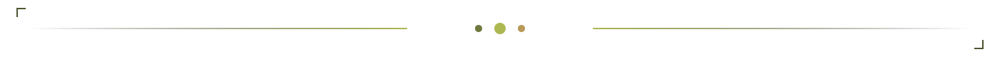
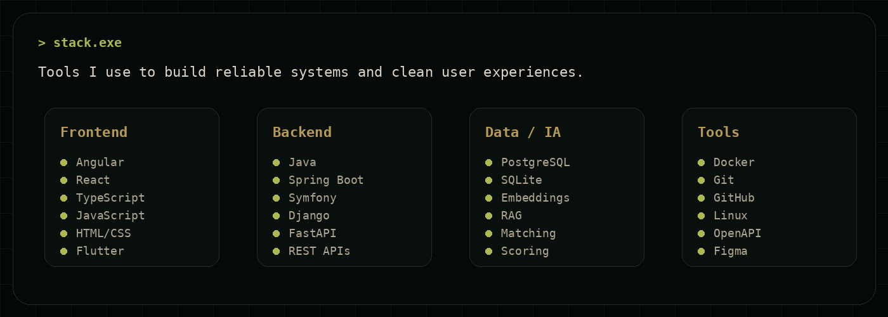
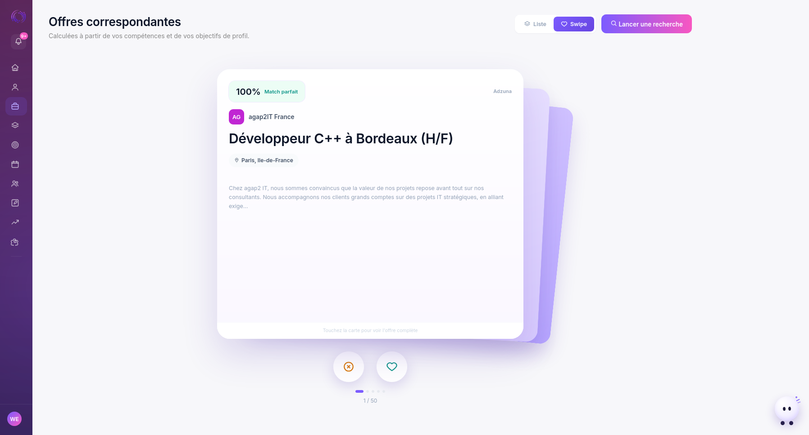
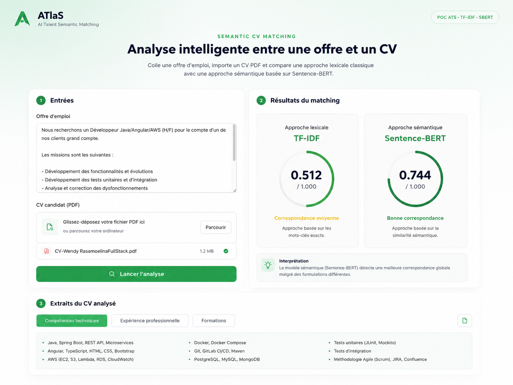
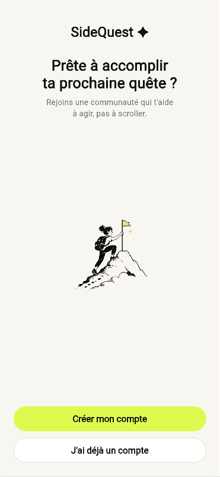

<div align="center">


</div>



## `identity.sys`

Je suis développeuse full-stack diplômée en informatique, avec une sensibilité forte pour le **produit**, le **webdesign**, l’**architecture applicative** et l’**IA appliquée**.

Je n’aime pas construire des écrans juste pour empiler des fonctionnalités.  
Ce qui m’intéresse, c’est de partir d’un vrai problème, comprendre les usages, structurer la donnée, concevoir un parcours clair, puis développer une application propre, fluide et maintenable.

Mon terrain naturel se trouve entre quatre mondes :

<table>
<tr>
<td width="25%" valign="top">

### `backend.core`

API REST, logique métier, sécurité, rôles, permissions, validation serveur, workflows, erreurs propres.

</td>
<td width="25%" valign="top">

### `interface.layer`

Interfaces responsives, dashboards, formulaires complexes, parcours utilisateurs, composants réutilisables.

</td>
<td width="25%" valign="top">

### `product.sense`

Compréhension du besoin, expérience utilisateur, clarté, cohérence, micro-détails, intention produit.

</td>
<td width="25%" valign="top">

### `ai.useful`

Matching, scoring, analyse textuelle, RAG, génération assistée, recommandations structurées.

</td>
</tr>
</table>

> Pour moi, le goût n’est pas seulement esthétique.  
> C’est une manière de penser l’interface, le code, les données et l’expérience utilisateur.

---

## `stack.exe`

<div align="center">



<br/>


</div>

```txt
Frontend      Angular · React · TypeScript · HTML · CSS · Flutter
Backend       Java Spring Boot · Symfony · Django · FastAPI
Database      PostgreSQL · SQLite · Doctrine ORM · Django ORM
AI / NLP      Gemini API · RAG · embeddings · scoring · matching
Dev tools     Docker · Git · GitHub · Linux · Swagger / OpenAPI
Product       UX flows · dashboards · design systems · documentation
```

---

## `mindset.log`

Je construis rarement une fonctionnalité comme un bloc isolé.  
J’essaie toujours de comprendre ce qu’elle implique autour :

```txt
01  comprendre le problème avant de coder
02  modéliser les données et les états
03  concevoir un parcours utilisateur lisible
04  sécuriser les actions sensibles
05  écrire une API prévisible
06  soigner les messages d’erreur
07  rendre l’interface agréable à utiliser
08  documenter ce qui doit survivre au projet
```

J’aime les projets où le frontend et le backend se répondent proprement :  
**un modèle clair, une API prévisible, une interface lisible, et une expérience cohérente de bout en bout.**

---

## `work.log`

<table>
<tr>
<td width="50%" valign="top">

### Alerte AMU

Application métier développée dans un contexte universitaire, autour de la gestion et du suivi d’alertes.

Ce projet m’a permis de travailler sur une application avec plusieurs profils utilisateurs, des workflows sensibles, des statuts, des validations, des documents, des décisions et une logique de traçabilité.

**Ce que j’ai travaillé :**

- conception d’écrans et de parcours métier ;
- échanges frontend / backend ;
- API REST ;
- rôles et permissions ;
- transitions de statuts ;
- gestion des erreurs ;
- logique de consultation et de décision ;
- fiabilité des actions critiques.

<br/>


</td>
<td width="50%" valign="top">

### Catalogue de formations AMU

Intervention sur le catalogue public des formations d’Aix-Marseille Université :  
[formations.univ-amu.fr](https://formations.univ-amu.fr/)

Ce projet représente un autre type de défi : comprendre une application existante, respecter son comportement, maintenir des routes et des traitements historiques, tout en modernisant progressivement l’architecture.

**Ce que j’ai travaillé :**

- maintenance et évolution d’une application existante ;
- compréhension de code legacy ;
- migration progressive vers Symfony ;
- services métier ;
- nettoyage et transformation de données ;
- templates Twig ;
- logique d’affichage publique ;
- respect du comportement existant.

<br/>


</td>
</tr>
</table>


## `selected.projects`

Mes projets personnels sont mon terrain d’expérimentation :  
j’y explore des idées produit, des architectures, des interfaces, des sujets IA, et des problématiques concrètes que j’ai envie de transformer en application.

---

<table>
<tr>
<td width="50%" valign="top">



### Clutchr (ancien Pulzr)

**Copilote de recherche d’emploi et d'optimisation Linkedin**

Clutchr remplace le tableur de suivi de candidatures par un copilote actif.

Le projet part d’un constat simple : chercher un emploi est souvent dispersé, répétitif, froid et mentalement épuisant.  
Clutchr transforme ce processus en système guidé : offres centralisées, scoring, pipeline Kanban, analyse d’écart de compétences, roadmap et contenu LinkedIn assisté par IA.

**Fonctionnalités clés :**

- scraping multi-sources ;
- moteur de matching maison ;
- pipeline de candidatures ;
- Career Pulse et Momentum ;
- analyse de compétences ;
- génération de roadmap ;
- contenus LinkedIn assistés par IA ;
- authentification Google ;
- 2FA TOTP.


</td>
<td width="50%" valign="top">



### ATlaS

**AI Talent Semantic Matching**

ATlaS est un moteur de matching CV/offre inspiré du fonctionnement réel des ATS.

Le projet est né d’une veille technologique sur le recrutement algorithmique : TF-IDF, BM25, SBERT, HNSW, scoring, similarité sémantique et Learning-to-Rank.

L’objectif : ne pas seulement calculer un score, mais expliquer l’écart entre un CV et une offre, puis proposer un plan d’amélioration concret.

**Fonctionnalités clés :**

- scoring lexical ;
- scoring sémantique ;
- extraction de compétences ;
- score de parseabilité ;
- score composite pondéré ;
- conseiller IA ;
- logique RAG ;
- recommandations structurées.


</td>
</tr>

<tr>
<td width="50%" valign="top">


### Baileo

**Plateforme de gestion locative**

Baileo est une plateforme de gestion locative pensée pour centraliser candidatures, documents, visites, décisions et échanges entre propriétaires, candidats et agences.

Le projet m’a permis de travailler une logique produit complète : plusieurs rôles, plusieurs parcours, des documents sensibles, une organisation en agence, des timelines, des statuts et des permissions.

**Fonctionnalités clés :**

- création de campagnes de location ;
- page publique d’annonce ;
- dossier candidat réutilisable ;
- suivi de candidature ;
- historique horodaté ;
- calendrier de visites ;
- messagerie ;
- mode agence ;
- rôles et permissions ;
- sécurité applicative.


</td>
<td width="50%" valign="top">



### SideQuest

**Gamification des tâches quotidiennes**

SideQuest est une application mobile de responsabilisation sociale et de gamification.

L’idée : transformer les petites actions qu’on repousse toujours en mini-quêtes sociales, avec preuves, alliés, crews, XP, niveaux et encouragements.

C’est un projet plus personnel dans son intention produit : créer une application motivante sans être culpabilisante, fun sans être infantilisante, sociale sans devenir anxiogène.

**Fonctionnalités clés :**

- catalogue de quêtes ;
- Excuse Breaker ;
- preuves d’action ;
- visibilité privée, alliés, crew ou publique ;
- XP et niveaux ;
- séries quotidiennes ;
- alliés d’accountability ;
- crews ;
- sécurité via Row Level Security.


</td>
</tr>
</table>

---

## `interests.cfg`

J’aime particulièrement les applications qui rendent une situation plus claire.

Un dashboard qui transforme des données dispersées en décision.  
Un outil métier qui fait gagner du temps.  
Un formulaire complexe qui devient simple.  
Un système de matching qui explique ses résultats.  
Une interface qui ne donne pas envie de fermer l’onglet.  
Une application qui a une personnalité sans sacrifier la fiabilité.

<table>
<tr>
<td width="33%" valign="top">

### `productivity.tools`

Outils de suivi, copilotes, dashboards, workflows, automatisation, recherche d’emploi, organisation personnelle.

</td>
<td width="33%" valign="top">

### `business.apps`

Applications métier, plateformes multi-rôles, interfaces d’administration, documents, validations, traçabilité.

</td>
<td width="33%" valign="top">

### `design.systems`

Webdesign, micro-interactions, direction artistique, wording, hiérarchie visuelle, pages qui respirent.

</td>
</tr>
<tr>
<td width="33%" valign="top">

### `ai.matching`

ATS, scoring, similarité sémantique, CV/offre, RAG, analyse textuelle, recommandations personnalisées.

</td>
<td width="33%" valign="top">

### `gamification`

XP, progression, quêtes, motivation, accountability, produits plus humains et moins culpabilisants.

</td>
<td width="33%" valign="top">

### `creative.tech`

Branding, storytelling, build in public, interfaces avec identité, produits qui ont une vraie voix.

</td>
</tr>
</table>

---

## `principles.md`

```txt
Reliability first        Je construis des systèmes que l’on peut comprendre et maintenir.
Clean interfaces         Une bonne interface réduit la charge mentale.
Useful AI only           L’IA doit expliquer, aider ou accélérer — pas décorer.
Product before stack     La stack sert le problème, pas l’inverse.
Taste is technical       Le détail visuel, le wording et le flow font partie de la qualité.
```

---

## `now.loading`

Je cherche à contribuer à des produits concrets, avec une vraie exigence technique et une attention portée à l’expérience utilisateur.

Je suis particulièrement intéressée par les environnements où l’on construit :

- des applications web métier ;
- des plateformes SaaS ;
- des outils internes ambitieux ;
- des produits avec une dimension IA utile ;
- des interfaces riches, propres et bien pensées ;
- des systèmes où la qualité du backend compte autant que l’expérience frontend.

---

<div align="center">


**WenSkills**  
_building with taste, logic and intention._
